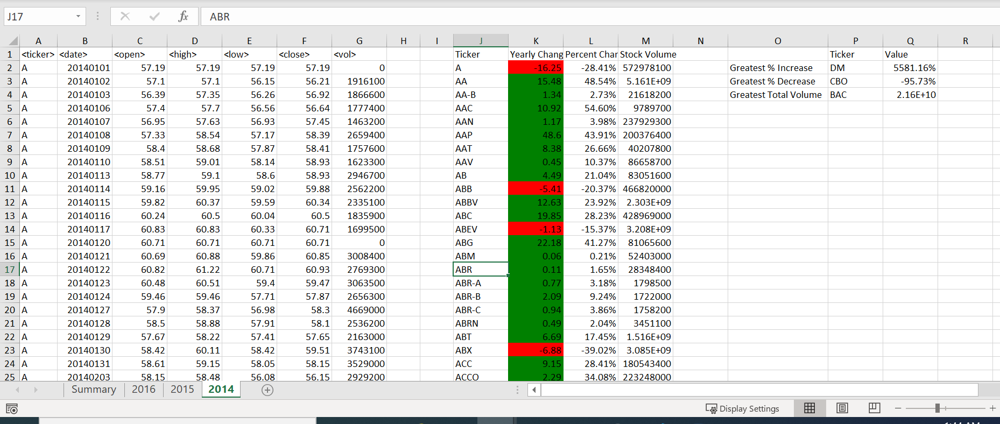
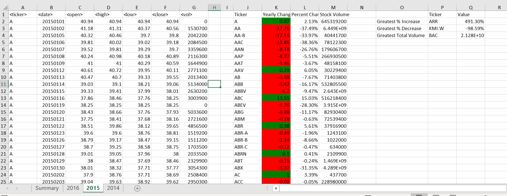
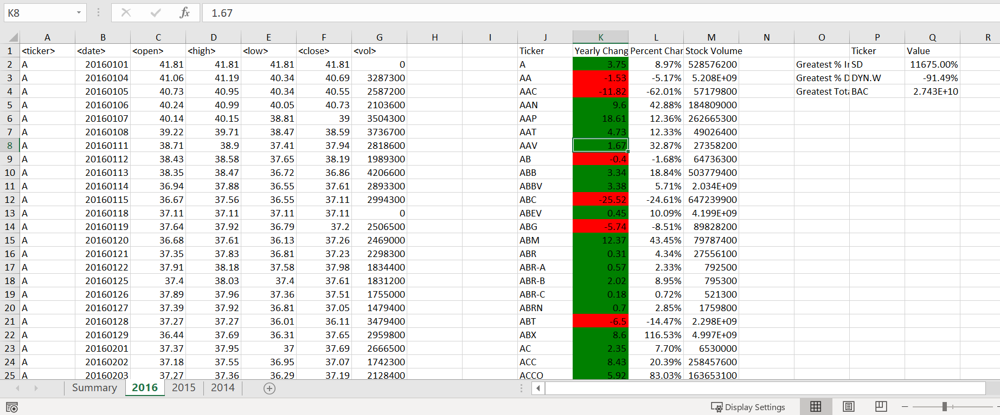

# VBA_Stock_Analysis

VBA is used to analyze stock prices over a period of one year. Stocks are analyzed to find volume and percent change for several worksheets in one workbook.

### Stock Prices Evaluated
Because this is done in excel/VBA, screenshots are provided with the end result:

* Overall Analysis for the year 2014 
  
    

* Overall Analysis for the year 2015 

    

* Overall Analysis for the year 2016

    
